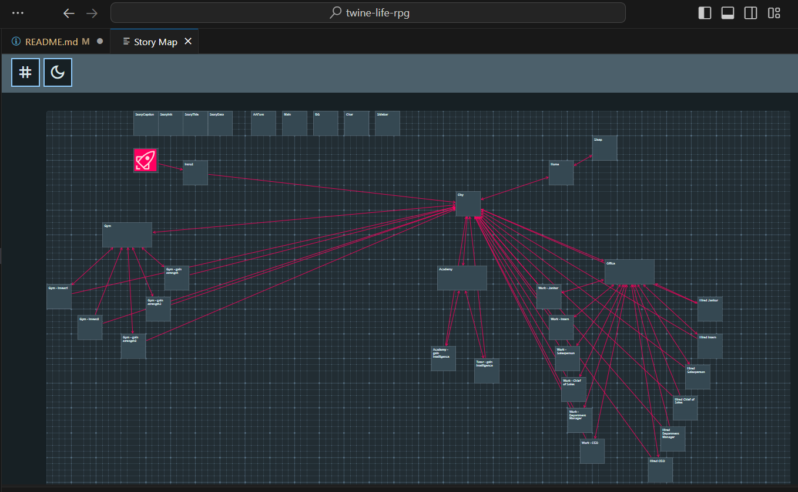

# Twee project starter  -  twine-life-rpg

### Starter for simple VNovel style game using Twee (code based version on twine)

Try online? [Demo](https://twee-starter.aronedwards.co.uk/)

## - What

The goal of this project is to make a simple example/starter for twee.

Twee - is a code based version of twine (https://twinery.org/), a super user friendly, no code, option for interactive fiction, this app is a starter for Twee/tweego (https://www.motoslave.net/tweego/) which allows you to write it out via a more code/file based manner, and then compile the result into a playable HTML.

The game itself is a mini-homage to the classic webgame [Stick RPG](http://www.xgenstudios.com/play/stickrpg)

## - Why

Twine is a very nice, easy to use app, **BUT** if you need to collaborate, you'll run into issues, also some, like myself, prefer a codebased system as allows for more iterable adjustments and some other nice tooling.

## - How

#### Build

To  build the HTML file / game, you will need to get the tweego file from (https://www.motoslave.net/tweego/), once downloaded you'll need to point your story folder to the .exe and give the output file a name:

Windows
`C:\Apps\tweego\tweego.exe -o build\index.html story`

Bash/Mac
`C:/Apps/tweego/tweego.exe -o build/index.html story`

To explain:

- `C:\Apps\tweego\tweego.exe` is the location of the tweego exe on your computer
- `-o` is an argument that says I'm about to tell you the name of the output
- `build\index.html` is the name of the output, (this will place a HTML file within the build folder of this project)
- `story` is the folder containing your .twee files, which will all be gathered up and used to create the game as a HTML file

Next step is to copy your `media` folder into the `build` folder, now you can hand over the entire build folder to anyone you want to play the game. Alternatively you can host is very easily on the web.

#### Hosting

Many modern web hosting providers allow you to host static files (Which the output of twine is) by simply giving the app your `build` folder.

Examples include [Netlify](https://www.netlify.com/), [Vercel](https://vercel.com/), [more...](https://www.pluralsight.com/blog/software-development/where-to-host-your-jamstack-site)

For Netlify, after signing up you simply go to the `/sites` page, scroll to the bottom where it says `Want to deploy a new site without connecting to Git? Drag and drop your site output folder here...` and drag the `build` folder into that box, then wait a moment, a sight will then be created, you'll just need to update the name.

It comes with 100GB monthly bandwidth, so it's rather generous.

## Help

Requires a build folder to exist for script to work

[user guide](GUIDE.md)

### Extra Tools

#### VSCode

**Install Twee 3 Language Tools** it's a must, this not only adds code styling, but allows you to open a story map so you can see how the sections come together:

